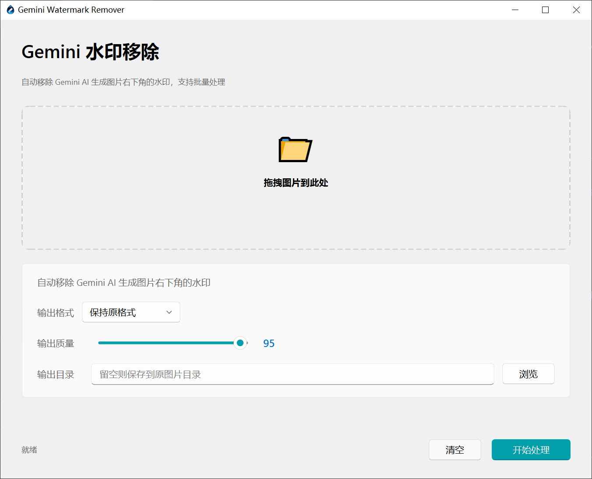

# Gemini Watermark Remover

[English](README_EN.md) | 简体中文

---

## ⚠️ 重要声明

**本项目仅为 [gemini-watermark-remover](https://github.com/journey-ad/gemini-watermark-remover) 的 Python 平台迁移版本。**

**所有水印移除的核心原理和算法均来自原仓库，本项目的唯一工作是将该优秀的技术方案移植到了 Python 平台，并基于 PySide6 构建了图形用户界面。**

原项目由 [@journey-ad](https://github.com/journey-ad) 开发，如果您觉得这个工具对您有帮助，请务必前往原仓库给作者支持和感谢！

---

一个用于自动移除 Gemini AI 生成图片右下角水印的桌面应用程序，支持批量处理。


## ✨ 功能特点

- 🔍 **自动检测** - 智能识别图片尺寸并选择合适的水印移除策略
- 📦 **批量处理** - 支持一次处理多张图片，提高效率
- 🎨 **多格式支持** - 支持 JPEG、PNG、WEBP 等多种输出格式
- ⚙️ **质量可调** - 可自由调节输出质量（1-100）
- 🎨 **现代化 UI** - 采用 Fluent 设计风格，界面简洁美观
- 🖱️ **拖拽操作** - 支持拖拽图片到窗口，操作便捷

## 📸 界面截图



简洁的单页面设计，拖拽图片即可开始处理，支持配置输出格式、质量和输出目录。

## 🚀 快速开始

### 环境要求

- Python 3.8 或更高版本
- Windows / macOS / Linux

### 安装步骤

1. **克隆仓库**

```bash
git clone https://github.com/yourusername/gemini-watermarkRemover-py.git
cd gemini-watermarkRemover-py
```

2. **安装依赖**

```bash
pip install -r requirements.txt
```

3. **下载背景图资源**

由于背景图资源文件较大，需要单独下载：

```bash
# 从原项目下载背景图
# https://github.com/journey-ad/gemini-watermark-remover
```

将下载的背景图文件放置到 `assets/gemini_watermark/` 目录：
- `bg_48.png`
- `bg_96.png`

4. **运行程序**

```bash
python main.py
```

## 📖 使用方法

1. 启动程序后，将带水印的图片拖拽到窗口中
2. （可选）配置输出参数：
   - **输出格式**：保持原格式 / JPEG / PNG / WEBP
   - **输出质量**：1-100
   - **输出目录**：留空则保存到原图片所在目录
3. 点击"开始处理"按钮
4. 等待处理完成，输出文件将添加 `_no_watermark_时间戳` 后缀

## 🛠️ 技术栈

- **Pillow** - Python 图像处理库
- **PySide6** - Qt 6 的 Python 绑定，用于构建 GUI
- **PySide6-Fluent-Widgets** - Fluent 设计风格的组件库
- **NumPy** - 用于数值计算和图像处理

## 📁 项目结构

```
gemini-watermarkRemover-py/
├── assets/
│   ├── icon.png                 # 应用图标
│   ├── 软件界面.png             # 界面截图
│   └── gemini_watermark/        # 背景图资源（需单独下载）
├── src/
│   ├── core/
│   │   └── gemini_watermark_remover.py  # 核心算法
│   └── ui/
│       ├── components/          # UI 组件
│       │   ├── file_list_widget.py
│       │   └── params_card.py
│       ├── pages/               # 页面
│       │   └── image_gemini_watermark_page.py
│       └── main_window.py       # 主窗口
├── main.py                      # 程序入口
├── requirements.txt             # 依赖列表
├── README.md                    # 中文文档
└── README_EN.md                 # 英文文档
```

## ⚠️ 注意事项

- 本项目仅支持移除 Gemini AI 生成的图片水印
- 需要预先生成背景图资源文件（`bg_48.png` 和 `bg_96.png`）
- 输出文件默认添加 `_no_watermark_时间戳` 后缀以避免覆盖原文件
- 请勿用于非法用途，仅供学习和个人使用

## 🤝 贡献

欢迎提交 Issue 和 Pull Request！

## 📄 许可证

本项目采用 [MIT](LICENSE) 许可证。

## 🙏 致谢

- **核心算法和实现原理**：[gemini-watermark-remover](https://github.com/journey-ad/gemini-watermark-remover) by [@journey-ad](https://github.com/journey-ad)
- **UI 组件库**：[PySide6-Fluent-Widgets](https://github.com/zhiyiYo/PySide-Fluent-Widgets)

## 📮 联系方式

如有问题或建议，欢迎提交 Issue 或通过以下方式联系：

- GitHub Issues: [提交问题](https://github.com/yourusername/gemini-watermarkRemover-py/issues)

---

⭐ 如果这个项目对您有帮助，请给个 Star 支持一下！
